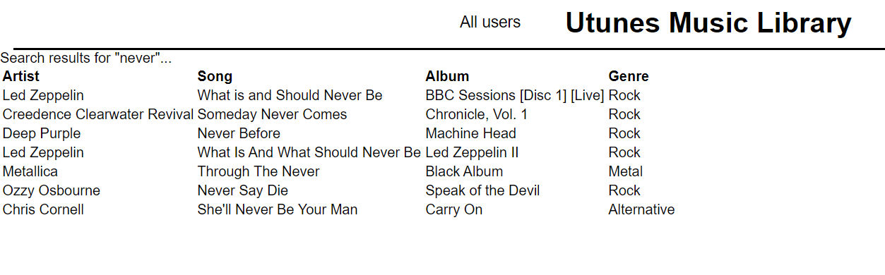

# Utunes Music Library

This is an application that takes the user on a journey through a database filled with songs by different artists and from different genres.
The home-page shows you a random asortment of songs, artists and genres that makes you wonder.. How many artists and songs and genres exist in this extensive database?!

## Usage
On a more serious note, this application is built with Spring Initializr and Maven. It uses a SQLite database and the JDBC API.
At the home-page, the user is presented with a view of 5 random songs, 5 random artists and 5 random genres. 
The user can make a search for a songname and will be redirected to a page where a table shows all the songs that contains the searchterm anywhere in the name.
The user will also be able to see a list of all the users in the database by navigating through the simple nav-bar to "All users".

Following is some screenshots of the webpage in action:

Homepage:

Searchresult:

## License
Emil Oja and Ludwig Carlsson, 2020
